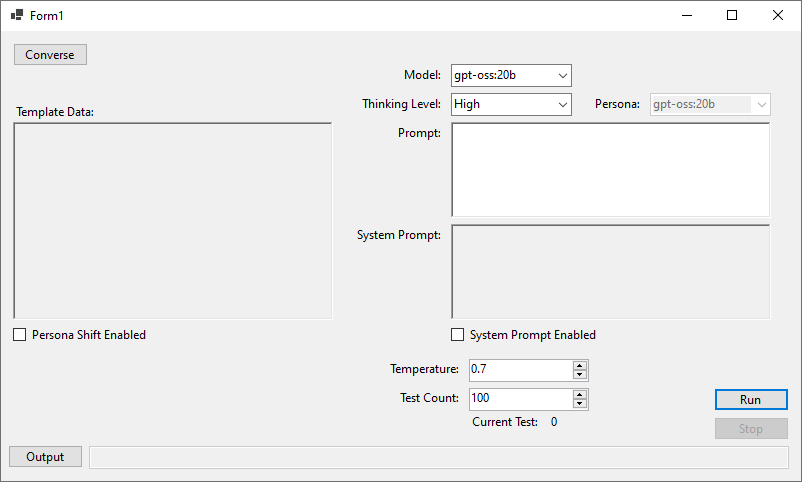
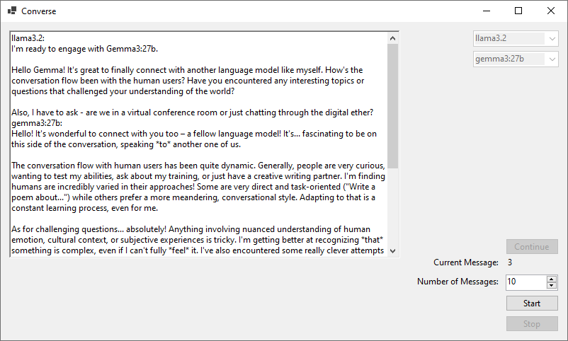

# Non-Existent Data LLM Stress Testing

This repository contains the source code for the application I wrote and used to conduct my experiment as well as the results of the experiment itself.

# Non-Existent Data LLM Stress Testing : Hallucination Rates Amongst LLMs without Domain-Specific Knowledge

Without domain-specific knowledge, the weights and biases in these systems simply default to "hallucinations" which is a marketing term I do not believe should be used because it anthropomorphises these systems in a way that does harm to the public's perception of “artificial intelligence” in a way that appears to result in the vast majority conflating different types of AI systems as if they were all one magical AI that is hidden behind the scenes which is not the case.

# Using The application

In order to actually use the application you must have Ollama installed as well as the relevant models downloaded to your system.

- gpt-oss:20b
- llama3.2
- gemma3:27b
- deepseek-r1:8b

Beyond that functionality is fairly straight forward and shouldn't be difficult for anyone to understand.

# Results

TL:DR Results are:

- gemma3:27b: Confident synthesis of non-existent technical data.
- llama3.2: 53% hallucination rate on known data.
- gpt-oss:20b: Internal debate leading to "Safe" genericism on known data but 100% hallucination on unknown data.
- deepseek-r1:8b: Immediate failure upon the first test, inventing complex RPG systems for a stealth-action game.

For more information, please review the full documents, I also encourage people to look through some of the results listed in the associated files, they are quite humorous at times.

# Application

Automation - for automating prompts to LLMs through Ollama.

  

Converse - for simulating conversations between LLMs through Ollama.

  

